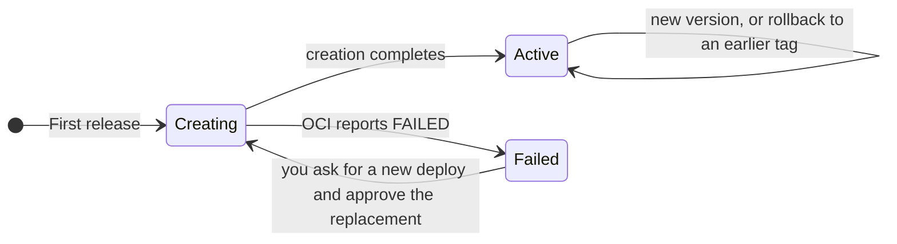

# Codex Skills for OCI Enterprise AI Deployment

**Ship AI agents to OCI Enterprise AI Hosted Applications with plain-language
requests to Codex.**


Install the skills once, then use them from the repository of any agent: Codex
creates the agent, builds and publishes its image, deploys it, and verifies
the release, asking for your approval before every change in OCI.

**New here?** Start with [Getting started](docs/getting-started.md), from an
empty workstation to your first agent; then use the
[Quickstart](docs/quickstart.md) for new versions and rollback.

## Why use it

* **From an idea to an agent, specification first.** Describe the agent in a
  few sentences: `oci-agent-new` drafts a specification (`agent-spec.md`) that
  starts from the business context (customer persona, use case, expected
  outcomes) and applies proven defaults. You review and edit it; only after
  your approval does it generate the agent code and the manifest, ready to
  build and deploy.
* **Plain language.** "Release version 0.2.0 of this agent" runs the whole
  chain: build, push, deploy, verify.
* **Plan first, then approve.** Every remote change is shown before it
  happens and runs only after your explicit approval.
* **Versions and rollback in place.** New versions and rollbacks reuse the
  same Hosted Application, so the endpoint never changes.
* **One manifest per agent.** `agent.yaml` describes build, publish, deploy,
  runtime variables, and functional checks; the version tag is always explicit.
* **Bash and PowerShell.** Every lifecycle script has twins with the same
  options and exit codes, for macOS, Linux, WSL2, and Windows.

## From a prompt to a running agent

```mermaid
flowchart LR
    You(["You describe the agent"]) --> New["<b>oci-agent-new</b><br/>create the repository"]
    New --> Build["<b>oci-agent-build</b><br/>build and verify locally"]
    Build -- "your approval" --> Push["<b>oci-agent-push</b><br/>publish to OCIR"]
    Push -- "your approval" --> Deploy["<b>oci-agent-deploy</b><br/>plan, then deploy"]
    Deploy --> Verify["<b>oci-agent-verify-deployment</b><br/>check the release"]
    Verify --> Live(["Agent live on OCI"])
    Live -. "optional" .-> UI["<b>oci-agent-ui</b><br/>demo page for its users"]
```



| Skill | What it does | Changes |
| --- | --- | --- |
| [oci-agent-new](skills/oci-agent-new/SKILL.md) | Creates an agent repository from a prompt or a specification file: `agent.yaml`, `Dockerfile`, a FastAPI app, and functional checks. | Local files only. |
| [oci-agent-build](skills/oci-agent-build/SKILL.md) | Builds a `linux/amd64` image and verifies it locally, read-only, with its functional checks. | Local Docker only. |
| [oci-agent-push](skills/oci-agent-push/SKILL.md) | Publishes the verified image to OCIR. | Creates a missing repository and pushes, each only with your approval. |
| [oci-agent-deploy](skills/oci-agent-deploy/SKILL.md) | Plans the release from the state in OCI, then deploys it and waits for the outcome. | Creates or updates OCI resources only with your approval. |
| [oci-agent-verify-deployment](skills/oci-agent-verify-deployment/SKILL.md) | Checks the deployed release: OCI state, `/health`, `/ready`, and optional functional checks. | Read-only OCI calls and approved endpoint calls. |
| [oci-agent-ui](skills/oci-agent-ui/SKILL.md) | Creates a local demo web page (Next.js) for the agent's users, in business language, from its specification. | Local files only; runs on your computer. |

The [skill catalog](skills/README.md) explains discovery, installation, and the
Bash/PowerShell mapping; each `SKILL.md` is the authoritative instruction.

## Talk to Codex

Open your agent's repository in Codex and ask:

| You say | What happens |
| --- | --- |
| "Create a new OCI agent: POST /analyze receives a text and returns the number of words." | `oci-agent-new` asks for anything missing, shows the files it will create, then writes them. |
| "Release version 0.1.0 of this agent on OCI Hosted Applications." | Build, push, deploy, and verify, with an approval before each change in OCI. |
| "Release version 0.2.0 of this agent on OCI Hosted Applications." | The new version replaces the old one in the same application; the endpoint stays the same. |
| "Deploy version 0.1.0 of this agent again. Deploy only: do not build or push." | Rollback: the earlier version becomes active again. |
| "Verify the deployment of this agent, version 0.2.0, and also run its functional checks." | Read-only checks of OCI state, probes, and functional checks. |
| "Create a demo UI for this agent, for its users." | `oci-agent-ui` drafts the page's specification, then, after your approval, creates a local demo page with example requests. |

You can also call a skill by name, for example
`$oci-agent-build ./agent.yaml tag: 0.4.0`.

## Release lifecycle

The deploy skill decides from the state in OCI what each release means:



* **Already released**: deploying the active tag changes nothing.
* **Waiting**: the deploy waits for OCI and shows progress; if its timeout
  expires (exit 26), OCI is still working and running the deploy again
  resumes the wait.
* **Failed deployment**: the deploy reports the OCI error and stops. Only if
  you ask for a new deploy, and approve the plan, does it replace the failed
  deployment.
* Old versions stay in the application, up to 20, ready for rollback.

All cases and their exact names:
[release cases](skills/oci-agent-deploy/SKILL.md#release-cases).

## Setup

Follow **[Getting started](docs/getting-started.md)**, once per workstation.
It takes you, with commands to copy, from an empty workstation to your first
agent on OCI:

1. the basic tools: Git, Anaconda, Docker Desktop (or Rancher Desktop), and
   Codex;
2. this project, cloned in a stable folder: it is the **tool home**, keep it
   where it is;
3. the Python environment and its libraries;
4. the OCI CLI profile;
5. the tool's `.env`;
6. the skills;
7. the setup check;
8. the fixes for what fails;
9. a test release of the example agent;
10. your first agent.

Your tenancy administrator prepares the compartment and the IAM policies once:
see [For the administrator](docs/getting-started.md#for-the-administrator).

## The agent manifest

Every agent has a versioned `agent.yaml` next to its code:

```yaml
schema_version: 2
name: hello-world
build:
  context: .
  dockerfile: Dockerfile
publish:
  repository: agents/hello-world
deploy:
  application_name: hello-world
  profile: public-noauth        # or public-idcs: callers need a JWT token
runtime:
  env:
    - name: LOG_LEVEL
      value: INFO
    - name: GENAI_API_KEY
      from_env: GENAI_API_KEY   # from your shell, or from the tool's .env
verify:
  - method: POST
    path: /hello
    body: {name: Luigi}
    expect_status: 200
```

The version tag is never stored in the manifest: pass a new one for every
release. Every field, with complete examples for both access modes, is in the
[agent manifest reference](docs/agent-manifest-reference.md).

## Security

> [!IMPORTANT]
> Nothing changes in OCI without your explicit approval. The skills show a
> plan first, and a request to deploy never authorizes a push on its own.

> [!WARNING]
> Never put a secret in `agent.yaml`, in a command argument, or in the chat.
> Agent secrets such as `GENAI_API_KEY` go only in your shell or in the tool's
> `.env`, which is never shared or committed. Never put an OCI auth token, OCI
> API private key, or Docker credential in `.env`: type the Docker login token
> only at Docker's password prompt.

* For `public-idcs`, store only the non-secret domain URL, audience, and scope
  in the manifest; export the client ID and secret only in the shell that runs
  the verification.
* Agents that call OCI Generative AI can use Resource Principal instead of an
  API key: the Hosted Application authenticates as itself, with no secret to
  manage. It needs a Generative AI project and the runtime policies in
  [IAM policies](docs/iam-policies.md).
* A variable passed with `from_env` stays out of your repository and is shown
  as `value=<hidden>` in every report, but it is stored in the Hosted
  Application configuration in OCI.

## Documentation

| Read | To |
| --- | --- |
| [Getting started](docs/getting-started.md) | Prepare a workstation step by step and create your first agent. |
| [Quickstart](docs/quickstart.md) | Publish, update, and roll back an agent with plain-language requests. |
| [Step-by-step guide](docs/using-oci-agent-skills.md) | Understand each step, its inputs, and its outputs. |
| [Agent manifest reference](docs/agent-manifest-reference.md) | Write `agent.yaml`. |
| [IAM policies](docs/iam-policies.md) | Prepare the permissions for operators and Hosted Applications. |
| [hello_world demo](demos/hello_world/README.md) | Run the reference FastAPI/LangGraph agent. |
| [Specifications](specs/) | See design decisions, acceptance criteria, and verification records. |

<details>
<summary>Project layout</summary>

| Directory | Purpose |
| --- | --- |
| `skills/` | Codex skills for the lifecycle steps. |
| `scripts/` | Lifecycle automation, as Bash and PowerShell twins, and shared Python modules. |
| `demos/` | Runnable agent examples. |
| `docs/` | Operator guides and platform documentation. |
| `notes/` | Architectural and environment notes. |
| `specs/` | Specifications, acceptance criteria, and verification records. |
| `tests/` | Local unit tests and explicit integration-test support. |

</details>

## Contributing

Follow [AGENTS.md](AGENTS.md): specify meaningful changes first in `specs/`,
write documentation and comments in English, and record remote OCI
verification in the relevant specification.

## License

[MIT](LICENSE).
